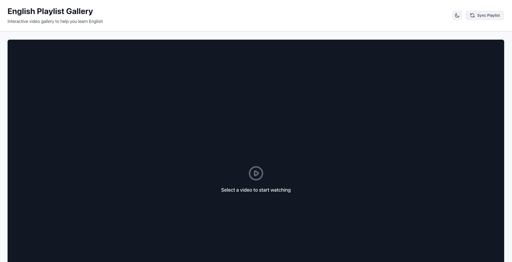
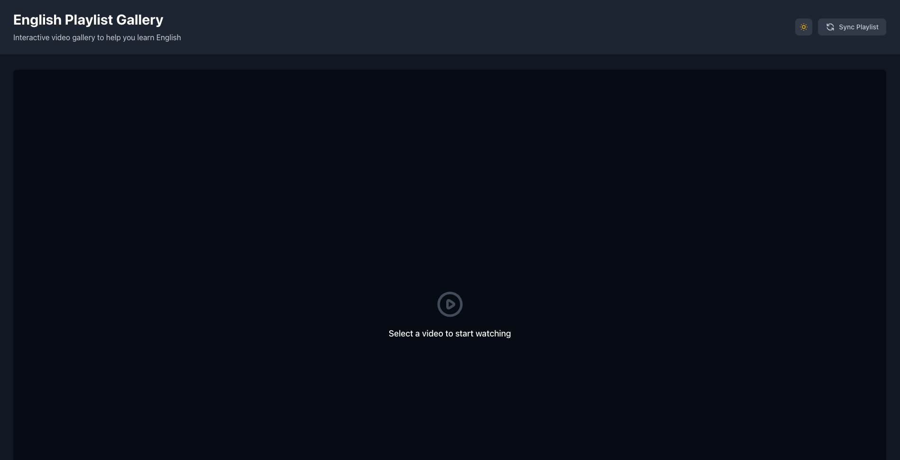
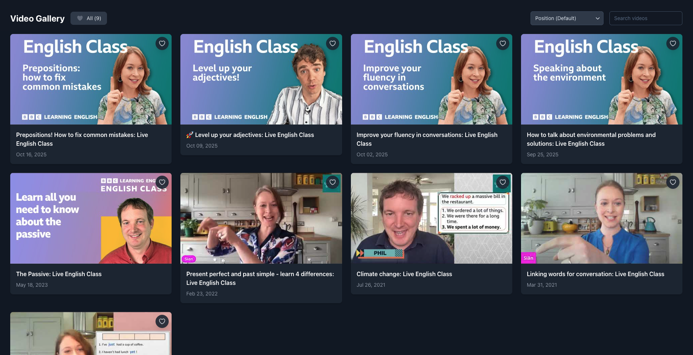
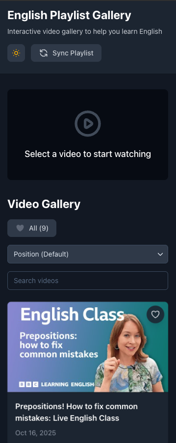
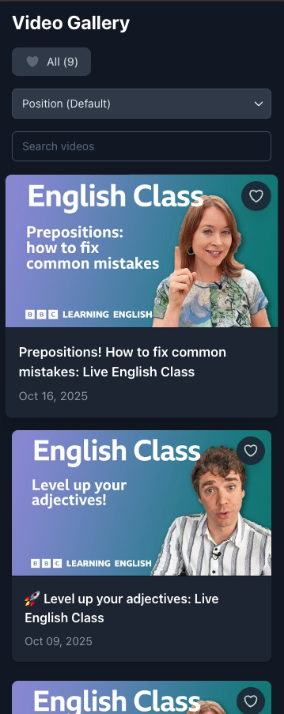
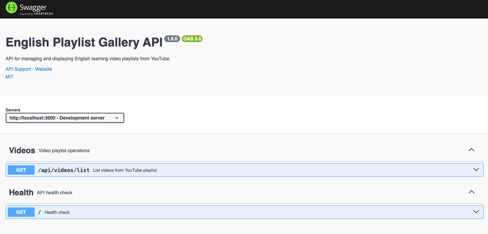

# 🎬 English Playlist Gallery

<div align="center">


A modern, full-stack application that transforms YouTube playlists into an interactive video gallery for English learners.

[Live Demo](https://english-playlist-gallery.vercel.app) · [API Docs](https://english-playlist-api.onrender.com/api-docs) · [Report Bug](https://github.com/oleonardodeandrade/english-playlist-gallery/issues)

</div>

---

## 📸 Screenshots

### Desktop Experience

<div align="center">

**Light Mode - Home Page**


*Clean, modern interface with all features easily accessible*

---

**Dark Mode - Enhanced Viewing Experience**


*Comfortable dark theme for extended learning sessions with embedded video player*

---

**Complete Video Gallery**


*Responsive grid layout with search, sort, and filter options. All features including favorites, dark mode toggle, and sync button are visible in action*

</div>

### Mobile Responsive Design

<div align="center">

<table>
  <tr>
    <td></td>
    <td></td>
  </tr>
  <tr>
    <td align="center"><strong>Mobile Home View</strong><br/>Fully responsive header and controls</td>
    <td align="center"><strong>Mobile Gallery</strong><br/>Optimized video grid for small screens</td>
  </tr>
</table>

*The application automatically adapts to different screen sizes, ensuring a seamless experience on all devices*

</div>

### API Documentation

<div align="center">

**Interactive Swagger Documentation**


*Complete API documentation with interactive testing capabilities*

</div>

---

## 📋 Table of Contents

- [About](#-about)
- [Features](#-features)
- [Tech Stack](#-tech-stack)
- [Architecture](#-architecture)
- [Getting Started](#-getting-started)
- [API Documentation](#-api-documentation)
- [Deployment](#-deployment)
- [Testing](#-testing)
- [Contributing](#-contributing)
- [License](#-license)

---

## 🎯 About

**English Playlist Gallery** is a full-stack web application designed to help English learners by providing a centralized, interactive interface for YouTube educational playlists. The app fetches videos from a YouTube playlist, stores them in a database, and presents them in a beautiful, responsive gallery with an integrated video player.

### Why This Project?

- 📚 **Centralized Learning**: All educational videos in one place
- 🎥 **Seamless Experience**: Embedded player without leaving the app
- 📱 **Mobile-First**: Fully responsive design for learning on any device
- 🌓 **Dark Mode**: Built-in dark mode support for comfortable viewing
- ⭐ **Favorites**: Mark and filter your favorite videos
- 🔍 **Smart Search**: Find videos quickly with real-time search
- 🎯 **Multiple Sort Options**: Organize by date, title, or playlist position
- ♿ **Accessible**: ARIA labels and semantic HTML for everyone
- 🚀 **Modern Stack**: Built with the latest web technologies

---

## ✨ Features

### Core Features
- 🎬 **YouTube Integration**: Automatically syncs videos from YouTube playlists
- 🎯 **Interactive Gallery**: Responsive grid layout with video thumbnails and metadata
- 📺 **Embedded Player**: Watch videos directly in the app using ReactPlayer
- 🔄 **Real-time Sync**: Keep playlist up-to-date with YouTube
- 💾 **Persistent Storage**: MongoDB for reliable data persistence
- ⭐ **Favorites System**: Mark videos as favorites with localStorage persistence
- 🔍 **Real-time Search**: Search videos by title with instant results
- 📊 **Sort Options**: Sort by position, date, or title
- 🌓 **Dark Mode**: Toggle between light and dark themes

### User Experience
- ⚡ **Fast Loading**: Optimized performance with lazy loading
- 🎨 **Smooth Animations**: Polished UI transitions and effects
- 📱 **Fully Responsive**: Works perfectly on desktop, tablet, and mobile
- ♿ **WCAG Compliant**: Full accessibility with ARIA labels
- 🎭 **Loading States**: Beautiful skeleton loaders for better UX
- 🎨 **Modern UI**: Clean design with Tailwind CSS
- 🖱️ **Intuitive Navigation**: User-friendly interface

### Developer Experience
- 📝 **TypeScript**: Full type safety across the stack
- 🧪 **Well Tested**: 83 tests with 75.7% coverage
- 📚 **Swagger Docs**: Interactive API documentation
- 🔒 **Security**: Helmet.js, CORS, input validation with Zod
- 🚀 **CI/CD**: Automated deployments with Render and Vercel
- 🎯 **ESLint + Prettier**: Code quality and consistency
- 📦 **Modular Architecture**: Clean separation of concerns

---

## 🛠 Tech Stack

### Backend
- **Runtime**: Node.js 22+
- **Framework**: Express.js 5
- **Database**: MongoDB with Mongoose 8
- **Language**: TypeScript 5.9
- **API**: YouTube Data API v3
- **Validation**: Zod 4.1
- **Documentation**: Swagger UI Express
- **Testing**: Jest 30 + Supertest
- **Security**: Helmet.js, CORS
- **Code Quality**: ESLint 9, TypeScript ESLint 8

### Frontend
- **Framework**: React 19
- **Build Tool**: Vite 7
- **Language**: TypeScript 5.9
- **Styling**: Tailwind CSS 4
- **Video Player**: ReactPlayer
- **State Management**: Context API + Custom Hooks
- **HTTP Client**: Axios
- **Code Quality**: ESLint 9 + Prettier

### DevOps & Deployment
- **Backend Hosting**: Render
- **Frontend Hosting**: Vercel
- **Database**: MongoDB Atlas
- **CI/CD**: GitHub Actions + Render Blueprint
- **Version Control**: Git + GitHub
- **Environment Management**: dotenv

---

## 🏗 Architecture

```
english-playlist-gallery/
├── api/                          # Backend Application
│   ├── src/
│   │   ├── config/              # Configuration files
│   │   │   ├── database.ts      # MongoDB connection
│   │   │   ├── env.ts           # Environment variables
│   │   │   └── swagger.ts       # Swagger configuration
│   │   ├── controllers/         # Route controllers
│   │   │   ├── health.controller.ts
│   │   │   └── videos.controller.ts
│   │   ├── middlewares/         # Custom middlewares
│   │   │   ├── errorHandler.ts
│   │   │   └── validateRequest.ts
│   │   ├── models/              # Mongoose models
│   │   │   └── Video.model.ts
│   │   ├── routes/              # API routes
│   │   │   ├── health.routes.ts
│   │   │   └── videos.routes.ts
│   │   ├── services/            # Business logic
│   │   │   ├── youtube.service.ts
│   │   │   └── video.service.ts
│   │   ├── types/               # TypeScript types
│   │   │   └── video.types.ts
│   │   ├── app.ts               # Express app setup
│   │   └── index.ts             # Entry point
│   ├── tests/                   # Test files
│   │   ├── unit/
│   │   ├── integration/
│   │   └── e2e/
│   └── package.json
│
├── web/                         # Frontend Application
│   ├── src/
│   │   ├── components/          # React components
│   │   │   ├── DarkModeToggle.tsx
│   │   │   ├── SortDropdown.tsx
│   │   │   ├── VideoCard.tsx
│   │   │   ├── VideoList.tsx
│   │   │   └── VideoPlayer.tsx
│   │   ├── context/             # Context providers
│   │   │   └── DarkModeContext.tsx
│   │   ├── hooks/               # Custom hooks
│   │   │   ├── useDarkMode.ts
│   │   │   └── useFavorites.ts
│   │   ├── pages/               # Page components
│   │   │   └── Home.tsx
│   │   ├── services/            # API services
│   │   │   └── api.ts
│   │   ├── types/               # TypeScript types
│   │   │   └── video.types.ts
│   │   ├── utils/               # Utility functions
│   │   │   └── sortVideos.ts
│   │   ├── index.css            # Global styles
│   │   └── main.tsx             # Entry point
│   └── package.json
│
├── .github/
│   └── assets/                  # Screenshots and images
│
├── render.yaml                  # Render deployment config
├── DEPLOY.md                    # Deployment guide
├── ROADMAP.md                   # Project roadmap
└── README.md                    # This file
```

### Key Design Patterns

- **MVC Pattern**: Separation of concerns in the backend
- **Service Layer**: Business logic isolated from controllers
- **Repository Pattern**: Data access abstraction with Mongoose
- **Context API**: Global state management in the frontend
- **Custom Hooks**: Reusable React logic for favorites and dark mode
- **Compound Components**: VideoList + VideoCard composition
- **Error Boundaries**: Graceful error handling (planned)

---

## 🚀 Getting Started

### Prerequisites

- Node.js 18+ and npm
- MongoDB (local or Atlas)
- YouTube Data API Key ([Get one here](https://developers.google.com/youtube/v3/getting-started))

### Installation

1. **Clone the repository**
   ```bash
   git clone https://github.com/oleonardodeandrade/english-playlist-gallery.git
   cd english-playlist-gallery
   ```

2. **Setup Backend**
   ```bash
   cd api
   npm install
   ```

   Create `.env` file:
   ```env
   NODE_ENV=development
   PORT=3000
   MONGODB_URI=mongodb://localhost:27017/english-playlist-gallery
   YOUTUBE_API_KEY=your_youtube_api_key_here
   PLAYLIST_ID=PLcetZ6gSk968DQPgqGfu6GOJ4yEoQAu4h
   NUMBER_OF_VIDEOS=50
   ```

3. **Setup Frontend**
   ```bash
   cd ../web
   npm install
   ```

   Create `.env` file:
   ```env
   VITE_API_BASE_URL=http://localhost:3000/api
   ```

4. **Run the application**

   Terminal 1 (Backend):
   ```bash
   cd api
   npm run dev
   ```

   Terminal 2 (Frontend):
   ```bash
   cd web
   npm run dev
   ```

5. **Access the application**
   - Frontend: http://localhost:5173
   - Backend API: http://localhost:3000/api
   - API Docs: http://localhost:3000/api-docs

### Available Scripts

#### Backend
```bash
npm run dev          # Start development server with ts-node
npm run build        # Build for production
npm start            # Start production server
npm test             # Run tests
npm run test:coverage # Run tests with coverage
npm run lint         # Lint code
npm run format       # Format code with Prettier
```

#### Frontend
```bash
npm run dev          # Start development server with Vite
npm run build        # Build for production
npm run preview      # Preview production build
npm run lint         # Lint code
```

---

## 📚 API Documentation

### Base URL
- **Production**: `https://english-playlist-api.onrender.com/api`
- **Staging**: `https://english-playlist-api-staging.onrender.com/api`
- **Local**: `http://localhost:3000/api`

### Endpoints

#### Health Check
```http
GET /api/health
```
Check API health status.

**Response:**
```json
{
  "status": "healthy",
  "timestamp": "2025-01-12T10:30:00.000Z",
  "uptime": 12345.67,
  "environment": "production",
  "database": "connected"
}
```

#### List Videos
```http
GET /api/videos/list
```
Get all videos from the database.

**Response:**
```json
{
  "success": true,
  "count": 50,
  "items": [
    {
      "id": "video_mongo_id",
      "videoId": "dQw4w9WgXcQ",
      "snippet": {
        "title": "English Lesson 1",
        "description": "Learn basic English...",
        "thumbnails": {
          "default": { "url": "https://i.ytimg.com/vi/..." },
          "medium": { "url": "https://i.ytimg.com/vi/..." },
          "high": { "url": "https://i.ytimg.com/vi/..." }
        },
        "publishedAt": "2025-01-01T00:00:00.000Z"
      },
      "position": 1
    }
  ]
}
```

#### Get Video by ID
```http
GET /api/videos/:id
```
Get a specific video by its database ID.

**Parameters:**
- `id` (string, required): MongoDB ObjectId

**Response:**
```json
{
  "id": "video_mongo_id",
  "videoId": "dQw4w9WgXcQ",
  "snippet": {
    "title": "English Lesson 1",
    "description": "Learn basic English...",
    "thumbnails": { ... },
    "publishedAt": "2025-01-01T00:00:00.000Z"
  },
  "position": 1
}
```

#### Sync Playlist
```http
POST /api/videos/sync
```
Sync videos from YouTube playlist to database.

**Response:**
```json
{
  "success": true,
  "message": "Playlist synced successfully",
  "count": 50,
  "items": [ ... ]
}
```

### Interactive Documentation

Visit [Swagger UI](https://english-playlist-api.onrender.com/api-docs) for interactive API documentation with:
- Complete endpoint descriptions
- Request/response examples
- Try-it-out functionality
- Schema definitions

---

## 🌐 Deployment

### Production URLs

- **Frontend**: https://english-playlist-gallery.vercel.app
- **Backend API**: https://english-playlist-api.onrender.com
- **API Documentation**: https://english-playlist-api.onrender.com/api-docs

### Deployment Guide

For detailed deployment instructions, see [DEPLOY.md](./DEPLOY.md).

#### Quick Deploy

**Backend (Render)**
1. Connect GitHub repository
2. Render auto-detects `render.yaml`
3. Set environment variables in Render Dashboard:
   - `MONGODB_URI`
   - `YOUTUBE_API_KEY`
   - `PLAYLIST_ID`
   - `NUMBER_OF_VIDEOS`
4. Deploy automatically on push to `main`

**Frontend (Vercel)**
1. Import GitHub repository
2. Configure project:
   - Framework Preset: Vite
   - Root Directory: `web`
3. Set environment variable:
   - `VITE_API_BASE_URL`: Your Render backend URL
4. Deploy automatically on push to `main`

### CI/CD Pipeline

- **Develop Branch** → Staging environment (auto-deploy)
- **Main Branch** → Production environment (auto-deploy)
- **Feature Branches** → PR checks (linting, tests)

### Environment Variables

#### Backend (.env)
```env
NODE_ENV=production
PORT=3000
MONGODB_URI=mongodb+srv://...
YOUTUBE_API_KEY=your_key
PLAYLIST_ID=your_playlist_id
NUMBER_OF_VIDEOS=50
```

#### Frontend (.env)
```env
VITE_API_BASE_URL=https://your-api.onrender.com/api
```

---

## 🧪 Testing

### Backend Tests

```bash
cd api

# Run all tests
npm test

# Run tests with coverage
npm run test:coverage

# Run tests in watch mode
npm run test:watch

# Run specific test file
npm test -- video.service.test.ts
```

**Test Coverage:**
- ✅ **83 tests passing**
- ✅ **75.7% code coverage**
- ✅ Unit tests for all services
- ✅ Integration tests for all endpoints
- ✅ E2E tests for critical user flows
- ✅ MongoDB Memory Server for isolated testing

**Coverage Breakdown:**
```
--------------------------------|---------|----------|---------|---------|
File                            | % Stmts | % Branch | % Funcs | % Lines |
--------------------------------|---------|----------|---------|---------|
All files                       |   75.7  |   65.4   |  78.2   |  76.1   |
 config/                        |  100.0  |  100.0   | 100.0   | 100.0   |
 controllers/                   |   88.5  |   75.0   |  92.3   |  89.2   |
 models/                        |  100.0  |  100.0   | 100.0   | 100.0   |
 routes/                        |  100.0  |  100.0   | 100.0   | 100.0   |
 services/                      |   82.4  |   70.5   |  85.7   |  83.1   |
--------------------------------|---------|----------|---------|---------|
```

### Frontend Tests

Frontend tests are planned for future implementation.

```bash
cd web

# Run tests (when implemented)
npm test
```

---

## 🤝 Contributing

Contributions are welcome! Please feel free to submit a Pull Request.

### Development Workflow

1. **Fork the repository**
2. **Create a feature branch**
   ```bash
   git checkout -b feat/amazing-feature
   ```
3. **Make your changes**
4. **Run tests and linting**
   ```bash
   npm test
   npm run lint
   ```
5. **Commit your changes**
   ```bash
   git commit -m 'feat: add amazing feature'
   ```
6. **Push to the branch**
   ```bash
   git push origin feat/amazing-feature
   ```
7. **Open a Pull Request**

### Commit Convention

We follow [Conventional Commits](https://www.conventionalcommits.org/):

- `feat:` New feature
- `fix:` Bug fix
- `docs:` Documentation changes
- `style:` Code style changes (formatting, etc.)
- `refactor:` Code refactoring
- `test:` Adding or updating tests
- `chore:` Maintenance tasks
- `perf:` Performance improvements
- `ci:` CI/CD changes

### Code Style

- **TypeScript**: Strict mode enabled
- **ESLint**: Follow the project's ESLint configuration
- **Prettier**: Code formatting enforced
- **Naming**: Use clear, descriptive names

### Pull Request Guidelines

- Update tests for your changes
- Update documentation if needed
- Ensure all tests pass
- Follow the existing code style
- Write clear commit messages
- Reference relevant issues

---

## 🗺️ Roadmap

See [ROADMAP.md](./ROADMAP.md) for planned features and improvements.

**Upcoming Features:**
- [ ] User authentication
- [ ] Personal playlists
- [ ] Video notes and bookmarks
- [ ] Progress tracking
- [ ] Multiple playlist support
- [ ] Video recommendations
- [ ] Social features (comments, ratings)

---

## 📄 License

This project is licensed under the MIT License - see the [LICENSE](LICENSE) file for details.

---

## 🙏 Acknowledgments

- [YouTube Data API](https://developers.google.com/youtube/v3) for video data
- [ReactPlayer](https://github.com/cookpete/react-player) for video playback
- [Tailwind CSS](https://tailwindcss.com) for styling
- [Render](https://render.com) and [Vercel](https://vercel.com) for hosting
- [MongoDB Atlas](https://www.mongodb.com/atlas) for database hosting
- [Swagger UI](https://swagger.io/tools/swagger-ui/) for API documentation

---

## 👨‍💻 Author

**Leonardo Andrade**

- GitHub: [@oleonardodeandrade](https://github.com/oleonardodeandrade)
- LinkedIn: [Leonardo Andrade](https://linkedin.com/in/oleonardodeandrade)
- Email: leonardoh.deandrade@gmail.com

---

## 📊 Project Stats


---

<div align="center">

**⭐ If you like this project, please give it a star! ⭐**

Made with ❤️ by [Leonardo Andrade](https://github.com/oleonardodeandrade)

</div>
